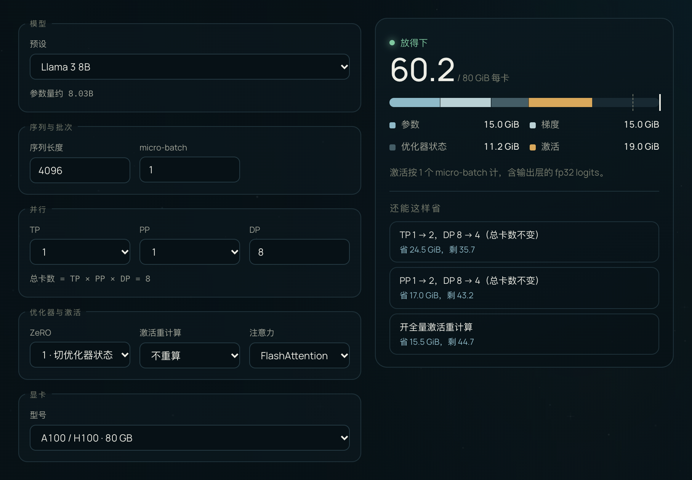
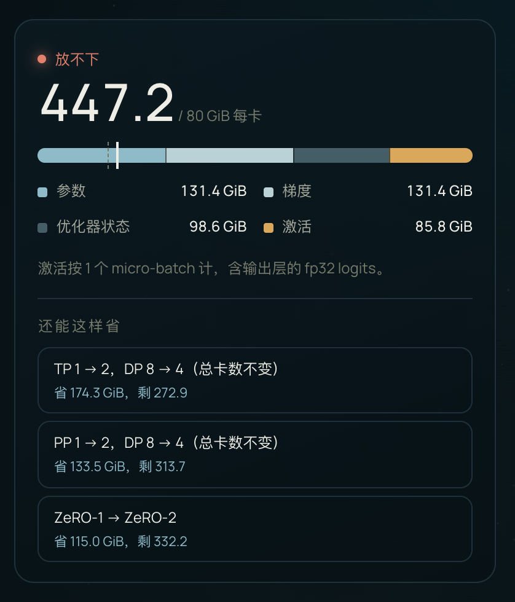

<div align="center">

# VRAM Ledger

**大模型训练显存账本 · 这个配置，放得下吗？**

把每张卡的显存拆成参数、梯度、优化器状态和激活四笔账；放不下时，告诉你先动哪个开关。

[**在线使用**](https://ai-loren.github.io/personal-homepage/#projects/vram-ledger) · [一个例子](#一个例子) · [怎么算的](#怎么算的) · [API](#api) · [English](#english)

[](LICENSE)   



</div>

## 为什么需要它

开一个训练任务之前，最先要回答的往往不是怎么调参，而是这套配置在这批卡上放不放得下。放不下，任务一启动就 OOM；放得太松，又白白多占了卡。

最常见的心算是「参数量 × 16 字节」。它漏掉了激活，也解释不了为什么开了流水线并行，第一段反而最紧。VRAM Ledger 把这些都摆到台面上：每一笔显存从哪来、为什么是这个数、改哪个开关最划算。

## 能做什么

- **四笔账**：参数、梯度、优化器状态、激活，各自多少 GiB、占多大比例，一眼看出谁是大头。
- **并行组合**：TP × PP × DP 任意组合，ZeRO 0–3，TP 大于 1 时按开启序列并行计。
- **激活细节**：按 Llama 式解码层逐个张量累加；可以切换全量重算、FlashAttention 或朴素注意力；流水线按 1F1B 找出最紧的那一段。
- **明确的判定**：以容量的 90% 作为安全线，给出「放得下 / 很紧 / 放不下」三档。
- **省显存的改法**：自动试几种改法，按能省多少排序；改 TP 或 PP 的建议会同时减半 DP，保持总卡数不变。
- **配置检查**：TP 除不尽 KV 头数、PP 除不尽层数这类配置会被拦下，并告诉你该改成什么，比如「TP 要能整除 KV 头数（按 KV 组切分），现在是 4 ÷ 8。把 TP 改成 1 / 2 / 4 之一。」
- **零依赖**：一个 JS 文件，纯前端运行，不联网，计算部分是纯函数。

## 一个例子



Llama 3 70B，序列 4096，micro-batch 1，8 张 80 GB 的卡全做数据并行（ZeRO-1）：

| | 每卡 |
| --- | ---: |
| 参数 | 131.4 GiB |
| 梯度 | 131.4 GiB |
| 优化器状态 | 98.6 GiB |
| 激活 | 85.8 GiB |
| **合计** | **447.2 GiB，放不下** |

它按能省多少给出改法：

1. TP 1 → 2，DP 8 → 4：省 174.3 GiB
2. PP 1 → 2，DP 8 → 4：省 133.5 GiB
3. ZeRO-1 → ZeRO-2：省 115.0 GiB

一路调下去，换成 128 张卡、TP 8 × PP 4 × DP 4，每卡只要 **24.8 GiB**。这时最紧的是流水线第一段，它要同时存 4 个 micro-batch 的激活。

<br clear="right">

## 快速开始

**在线**：打开 [ai-loren.github.io/personal-homepage/#projects/vram-ledger](https://ai-loren.github.io/personal-homepage/#projects/vram-ledger)，改配置，结果立刻更新。

**在自己的页面里用**：引入脚本后，工具注册在 `window.SITE_TOOLS['vram-ledger']` 上。

```html
<script src="vram-ledger.js"></script>
<script>
  const ledger = window.SITE_TOOLS['vram-ledger'];
  const result = ledger.estimate({
    model: { layers: 32, hidden: 4096, heads: 32, kvHeads: 8, ffn: 14336, vocab: 128256 }, // Llama 3 8B
    seq: 4096, micro: 1,
    tp: 1, pp: 1, dp: 8,
    zero: 1, recompute: 'none', attention: 'flash',
    memory: 80, // 每卡显存，GiB
  });

  const GiB = 1024 ** 3;
  console.log((result.total / GiB).toFixed(1), result.level); // 60.2 fit
  // parts: 参数 15.0 · 梯度 15.0 · 优化器状态 11.2 · 激活 19.0（GiB）
</script>
```

想要现成的界面，就调 `ledger.mount(element)`。它会渲染完整的表单和结果面板，结构上带 `vram-*` 类名，样式由你的页面提供。

## 内置预设

| 模型 | 层数 $L$ | 隐藏维度 $h$ | 头数 $a$ | KV 头数 | FFN $f$ | 词表 $V$ | 参数量 |
| --- | ---: | ---: | ---: | ---: | ---: | ---: | ---: |
| Llama 3 8B | 32 | 4096 | 32 | 8 | 14336 | 128256 | 8.03B |
| Llama 3 70B | 80 | 8192 | 64 | 8 | 28672 | 128256 | 70.55B |
| Qwen2.5 7B | 28 | 3584 | 28 | 4 | 18944 | 152064 | 7.62B |
| Qwen2.5 72B | 80 | 8192 | 64 | 8 | 29568 | 152064 | 72.71B |

也可以选「自定义」，填任意结构。显卡预设有 RTX 4090（24 GB）、A100（40 GB）、A100 / H100（80 GB）、H20（96 GB）、H200（141 GB）和 B200（192 GB）。

## 怎么算的

符号：$s$ 序列长度，$b$ micro-batch，$h$ 隐藏维度，$h_{kv}$ KV 宽度（KV 头数 × 每头维度），$f$ FFN 维度，$a$ 注意力头数，$V$ 词表大小，$L$ 层数，$t$ / $p$ / $d$ 为 TP / PP / DP，$P$ 为参数量。

### 参数、梯度与优化器状态

按 bf16 混合精度加 Adam 计，每个参数 2 + 2 + 12 字节，其中 12 字节是 fp32 的主权重、一阶矩和二阶矩。模型先按 TP × PP 切开，每卡分到 $\Psi = P / (t \cdot p)$ 个参数，ZeRO 再按阶段除以 DP：

| ZeRO | 参数 | 梯度 | 优化器状态 |
| --- | --- | --- | --- |
| 0 | $2\Psi$ | $2\Psi$ | $12\Psi$ |
| 1 | $2\Psi$ | $2\Psi$ | $12\Psi / d$ |
| 2 | $2\Psi$ | $2\Psi / d$ | $12\Psi / d$ |
| 3 | $2\Psi / d$ | $2\Psi / d$ | $12\Psi / d$ |

### 激活

每层每个 micro-batch 要为反向存下的字节数（Llama 式解码层：RMSNorm、GQA、SwiGLU、无 dropout；TP 大于 1 时按开启序列并行计）：

```math
A_{\text{layer}} = \frac{12\,sbh + 4\,sb\,h_{kv} + 6\,sbf}{t}
```

<details>
<summary>这几项分别是哪些张量</summary>

| 张量 | 字节 |
| --- | --- |
| 两个 RMSNorm 的输入 | $2 \times 2sbh$ |
| 注意力输入、Q、注意力输出 | $3 \times 2sbh$ |
| MLP 输入 | $2sbh$ |
| K、V | $2 \times 2sb\,h_{kv}$ |
| gate、up 两路输出 | $2 \times 2sbf$ |
| SiLU(gate) ⊙ up，即 down 的输入 | $2sbf$ |

合计 $12sbh + 4sb\,h_{kv} + 6sbf$。

</details>

- **朴素注意力**：每层再加注意力矩阵 $2as^2b / t$；FlashAttention 不存它。
- **全量重算**：每层只留输入 $2sbh / t$，反向时再临时展开一层的全部激活。
- **流水线（1F1B）**：第一段要同时存 $p$ 个 micro-batch 的激活，最后一段只存一个，但要多存输出层的输入和 fp32 logits。结果取两段里更紧的那一段，并假设 micro-batch 数不少于段数：

```math
A_{\text{first}} = p \cdot \frac{L}{p} \cdot A_{\text{layer}} = L \cdot A_{\text{layer}}
\qquad
A_{\text{last}} = \frac{L}{p} \cdot A_{\text{layer}} + \frac{4\,sbh + 4\,sbV}{t}
```

所以开流水线省的是参数和优化器状态，省不了第一段的激活。

### 判定

总量不超过容量的 90% 记「放得下」，超过 90% 但没超容量记「很紧」，超过容量记「放不下」。

## 适用范围

这是按公式做的估算，不是实测。以下几项没有算进去，所以才留出 10% 的余量：

- CUDA 上下文、NCCL 通信缓冲、显存碎片和各种临时张量
- ZeRO-3 前向时临时聚合的整层参数
- MoE、LoRA、FP8 训练、CPU offload、交错式（interleaved）1F1B
- 线性层的 bias：Llama 3 8B / 70B 的参数量与官方逐位一致，Qwen2.5 因为少算了 QKV bias，差了不到十万分之二

## API

| 导出 | 说明 |
| --- | --- |
| `estimate(config)` | 返回 `{ params, parts, total, capacity, level, stage, gpus }`，显存单位是字节；配置不成立时只返回 `{ error }` |
| `suggestions(config)` | 最多三种省显存的改法，按省下的量排序，每项是 `{ label, change, total, saved }` |
| `parameterCount(model)` | 按模型结构算参数量 |
| `mount(element)` | 在元素里渲染完整的表单和结果面板 |
| `MODELS` / `GPUS` / `DEFAULTS` | 内置的模型预设、显卡型号和表单默认值 |

**`config`**

| 字段 | 含义 |
| --- | --- |
| `model` | `{ layers, hidden, heads, kvHeads, ffn, vocab }` |
| `seq` / `micro` | 序列长度 / micro-batch |
| `tp` / `pp` / `dp` | 张量 / 流水线 / 数据并行度 |
| `zero` | `0`–`3` |
| `recompute` | `'none'` 或 `'full'` |
| `attention` | `'flash'` 或 `'naive'` |
| `memory` | 每卡显存，GiB |

**返回值**

| 字段 | 含义 |
| --- | --- |
| `parts` | `{ weights, grads, optimizer, activations }`，字节 |
| `total` / `capacity` | 每卡合计 / 每卡容量，字节 |
| `level` | `'fit'`、`'tight'` 或 `'over'` |
| `stage` | 激活按哪一段计：`'only'`（没开流水线）、`'first'` 或 `'last'` |
| `params` / `gpus` | 参数量 / 总卡数 $t \cdot p \cdot d$ |

## 测试

```bash
node --test
```

需要 Node 18 以上，不用安装依赖。测试里的期望值都按论文公式手算后写成字面数字，覆盖这些内容：

- 四个预设的参数量
- ZeRO 0–3 各自切掉的部分
- 每层激活、朴素注意力、全量重算与 TP 的组合
- 1F1B 下第一段与最后一段的取舍
- 90% 安全线的边界
- 非法配置的错误信息
- 改法建议的排序，以及「总卡数不变」

## 参考

- Rajbhandari et al. [ZeRO: Memory Optimizations Toward Training Trillion Parameter Models](https://dl.acm.org/doi/10.5555/3433701.3433727). SC 2020.
- Korthikanti et al. [Reducing Activation Recomputation in Large Transformer Models](https://proceedings.mlsys.org/paper_files/paper/2023/hash/80083951326cf5b35e5100260d64ed81-Abstract-mlsys2023.html). MLSys 2023.
- Narayanan et al. [Efficient Large-Scale Language Model Training on GPU Clusters Using Megatron-LM](https://dl.acm.org/doi/10.1145/3458817.3476209). SC 2021.

## English

VRAM Ledger estimates per-GPU memory for LLM training and answers one question before you launch a job: does this model and parallel layout fit on these cards, and if not, which switch should you flip first?

- Splits memory into **parameters, gradients, optimizer states and activations** (bf16 + Adam).
- Handles **TP × PP × DP**, **ZeRO 0–3**, sequence parallelism, **full activation recomputation**, FlashAttention vs. naive attention, and the **1F1B** pipeline, where the first stage holds activations for `p` micro-batches.
- Flags `fit` / `tight` / `over` against a 90% safe line, and ranks alternatives by memory saved. Suggestions that change TP or PP halve DP, so the GPU count stays the same.
- A single dependency-free JavaScript file. Try it [online](https://ai-loren.github.io/personal-homepage/#projects/vram-ledger), or call `window.SITE_TOOLS['vram-ledger'].estimate(config)`; the formulas and API are documented above.

## License

[MIT](LICENSE)
